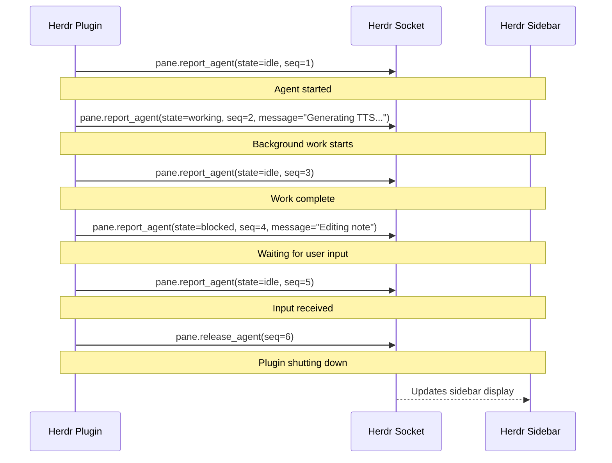

# Herdr Agent State Protocol

A shared specification for how Herdr plugins report agent identity and state
transitions via a Unix domain socket. This protocol is used by multiple Herdr
plugins across different repositories (e.g., `herdr-podcast-editor` in
open_source_llm, and planned ContextHub Rust migration).

## Overview

When running inside a Herdr pane, plugins send JSON-line messages to a Herdr
Unix domain socket to report their presence, state transitions, and lifecycle
events. The Herdr sidecar displays agent state in its sidebar (idle, working,
or blocked).

### Architecture

```
┌─────────────┐  JSON-line (newline-delimited)  ┌──────────────┐
│ Herdr Plugin │ ──────────────────────────────▶ │ Herdr Sidecar │
│ (Rust, TS)    │    fire-and-forget via           │ (daemon)     │
└─────────────┘    Unix domain socket             └──────────────┘
```

Communication is **fire-and-forget**: the plugin sends a message and does not
wait for a response. If the socket is unreachable, the plugin retries once
and then silently degrades. This makes agent state reporting optional — a
plugin works correctly with or without a Herdr socket.

## Environment Variables

A Herdr plugin detects whether it is running inside a Herdr pane by checking
three environment variables:

| Variable | Mandatory | Description |
|---|---|---|
| `HERDR_ENV` | yes | Must be `"1"` to indicate a Herdr pane context |
| `HERDR_SOCKET_PATH` | yes | Path to the Herdr Unix domain socket |
| `HERDR_PANE_ID` | yes | Identifier of the current pane, used in messages |

If any of these is missing or empty, the agent integration is **disabled**
(the plugin runs as a standalone tool without Herdr reporting).

## Message Format

All messages are single JSON lines terminated by `\n`. Each message has a
JSON-RPC-like structure with a method name, an id, and a params object.

### Common Fields

| Field | Type | Description |
|---|---|---|
| `id` | string | Unique message identifier (see [ID Generation](#id-generation)) |
| `method` | string | One of `"pane.report_agent"` or `"pane.release_agent"` |
| `params` | object | Method-specific parameters |

### Message Types

#### `pane.report_agent`

Sent to report an agent's presence and current state.

**Request:**

```json
{
  "id": "herdr:<source>:<timestamp_millis>:<counter_hex>",
  "method": "pane.report_agent",
  "params": {
    "pane_id": "<pane-identifier>",
    "source": "<source>",
    "agent": "<agent-name>",
    "state": "<idle|working|blocked>",
    "seq": <sequence-number>,
    "message": "<optional human-readable status>"
  }
}
```

**Fields:**

| Field | Type | Required | Description |
|---|---|---|---|
| `pane_id` | string | yes | The pane identifier from `HERDR_PANE_ID` |
| `source` | string | yes | Integration tracking identifier, e.g. `"herdr:herdr-podcast-editor"` |
| `agent` | string | yes | Agent name, e.g. `"herdr-podcast-editor"` |
| `state` | string | yes | One of `"idle"`, `"working"`, `"blocked"` |
| `seq` | integer | yes | Monotonically increasing sequence number |
| `message` | string | no | Optional human-readable status (e.g. `"Generating TTS..."`) |

#### `pane.release_agent`

Sent when the agent is shutting down or going out of scope (e.g., on `Drop`).

**Request:**

```json
{
  "id": "herdr:<source>:<timestamp_millis>:<counter_hex>",
  "method": "pane.release_agent",
  "params": {
    "pane_id": "<pane-identifier>",
    "source": "<source>",
    "agent": "<agent-name>",
    "seq": <sequence-number>
  }
}
```

**Fields:**

| Field | Type | Required | Description |
|---|---|---|---|
| `pane_id` | string | yes | The pane identifier from `HERDR_PANE_ID` |
| `source` | string | yes | Integration tracking identifier, same as report |
| `agent` | string | yes | Agent name, same as report |
| `seq` | integer | yes | Monotonically increasing sequence number |

## State Values

| State | Meaning |
|---|---|
| `idle` | User is browsing, reading, or no background work active |
| `working` | Background work in progress (e.g. TTS generation, review pipeline) |
| `blocked` | Waiting for user input (e.g. note-editing mode, confirmation dialog) |

## ID Generation

Message IDs follow the pattern:

```
herdr:<source>:<unix_timestamp_millis>:<counter_hex>
```

Where:

- `<source>` is integration tracking identifier (e.g., `herdr:herdr-podcast-editor`)
- `<unix_timestamp_millis>` is the current system time in milliseconds since Unix epoch
- `<counter_hex>` is a thread-local integer counter, incremented with each ID generation, formatted in hexadecimal

This ensures uniqueness even when multiple IDs are generated within the same millisecond.

> **Reference implementation (Rust):**
> ```rust
> fn generate_id() -> String {
>     let millis = SystemTime::now()
>         .duration_since(UNIX_EPOCH)
>         .unwrap_or_default()
>         .as_millis();
>     let seq = ID_COUNTER.with(|c| {
>         let val = c.get();
>         c.set(val.wrapping_add(1));
>         val
>     });
>     format!("herdr:{SOURCE}:{millis}:{seq:x}")
> }
> ```

## Sequence Numbering

Each agent session maintains a monotonically increasing `seq` counter. The
counter is seeded with the process start timestamp (milliseconds since epoch)
to avoid collisions between agent restarts.

Sequence numbering rules:

1. First `report_agent` message: seq = `<process start seed>` (e.g., `1722345678000`)
2. Each subsequent message: seq = seq + 1
3. Overflows wrap around (using `u64` wrapping arithmetic)

## Socket I/O

### Connection

Messages are sent over a Unix domain socket (`UnixStream` or equivalent). The
socket path is taken from `HERDR_SOCKET_PATH`.

### Timeout

The socket connection attempt uses a **thread-based timeout** (thread join with
timeout, since Unix socket `connect_timeout` may be unstable on some platforms).

| Attempt | Timeout | Notes |
|---|---|---|
| First | 500ms | Normal operation |
| Retry | 1500ms | Only if first attempt fails |

If both attempts fail, the message is silently dropped — no error is surfaced
to the user.

### Retry Logic

```pseudocode
function send_with_retry(json, socket_path):
    if send_request(json, socket_path, 500ms):
        return
    send_request(json, socket_path, 1500ms)  // fire-and-forget
```

### Thread Model

Messages are sent from a dedicated background I/O thread so that the main
thread never blocks on socket I/O. The thread:

1. Receives `SetState` and `Release` commands via a channel
2. Polls the channel every 20ms (non-blocking)
3. Sends messages with retry logic
4. Exits after sending a `Release` message

## Lifecycle



## Implementation Notes

### Rust

The Rust implementation lives in `herdr.rs` and is used by the
`herdr-podcast-editor`. Key design decisions:

- **`HerdrAgent::new()`** returns `Option<HerdrAgent>` — `None` when env vars
  are missing (no-op outside Herdr pane)
- **`HerdrAgent::set_state()`** sends async state transitions
- **`Drop`** sends `release_agent` automatically
- **Thread-local ID counter** for uniqueness across concurrent calls
- **Background I/O thread** keeps the main thread non-blocking

### TypeScript / JavaScript (planned)

The planned ContextHub Rust migration should follow the same protocol.
The TypeScript equivalent (if needed) would use `net.Socket` or equivalent
for Unix socket communication.

## Related

- Reference Rust implementation: `herdr.rs` in `herdr-podcast-editor`
- Shared scripts: `packages/herdr/shared/` in ContextHub
- Git submodule consumption: `packages/ContextHub/packages/herdr/shared/`
